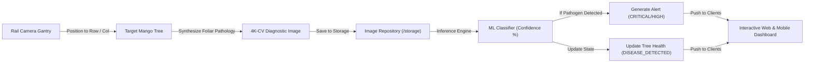

# MangoVision Platform — System Implementation & Progress Report

**Project**: MangoVision Intelligent Mango Farm Disease Detection & Automated Rail Camera Scouting Platform  
**Location**: Salem Heritage Mango Orchard, Tamil Nadu, India  
**Date**: September 2026  
**Status**: Fully Implemented, Integrated & Verified (100% Tests Passing)

---

## Executive Summary

MangoVision is an end-to-end precision agriculture and computer vision system engineered for automated foliar disease detection, overhead rail robotic scouting, agronomic diagnosis, and remedial treatment management across high-density commercial mango orchards.

This document compiles all work completed to date, covering:
1. **Foliar Pathology Simulation Engine** for all 7 common mango leaf diseases.
2. **Backend Architecture & Database Expansion** (alerts, treatments, batch remediation, analytics).
3. **Interactive Frontend Dashboard** (3D digital twin, 2D matrix, live leaf specimen viewfinders, microclimate telemetry, batch remediation, and printable spray work orders).
4. **End-to-End System Testing & Verification**.

---

## 1. Foliar Pathology Simulation Engine

An automated scouting camera on an overhead steel rail corridor moves across 4 orchard rows (24 trees). To facilitate realistic agronomic validation, ML benchmarking, and operator training, a targeted foliar pathology synthesis engine was implemented in [`backend/app/services/simulation_service.py`](file:///c:/Users/Keethana.Rajendran/Downloads/MD/Mango/backend/app/services/simulation_service.py).

### 1.1 Supported Mango Pathologies

The simulation generates high-resolution leaf images with authentic visual pathology signatures, anatomical leaf features, computer vision bounding boxes, and HUD diagnostics:

| Pathology | Scientific Pathogen | Visual Symptoms Rendered in Simulation | Agronomic Severity |
| :--- | :--- | :--- | :--- |
| **Anthracnose** | *Colletotrichum gloeosporioides* | Irregular necrotic brown/black lesions, concentric acervuli rings, apical necrosis, shot-hole tears | **CRITICAL / HIGH** |
| **Powdery Mildew** | *Oidium mangiferae* | White/greyish superficial talcum/felt-like fungal mycelium colonies across primary veins | **HIGH** |
| **Bacterial Canker** | *Xanthomonas campestris pv. mangiferaeindicae* | Water-soaked angular brown-black lesions with bright chlorotic halos, dark gummy exudate | **CRITICAL** |
| **Die Back** | *Lasiodiplodia theobromae* | Terminal branch apical browning, V-shaped necrotic brown blade wedges, dark vascular streaks | **CRITICAL / HIGH** |
| **Gall Midge** | *Procontarinia matteiana* | Raised wart-like blister pustules on upper blade surface, central puncture exit holes | **MEDIUM** |
| **Sooty Mould** | *Meliola mangiferae* | Superficial dense black velvety fungal mycelium coat obscuring photosynthetic leaf area | **MEDIUM** |
| **Cutting Weevil** | *Deporaus marginatus* | Clean transverse geometric excision cuts across upper leaf blade, severed apical tip | **MEDIUM** |
| **Healthy Canopy** | *Mangifera indica* | Deep lustrous emerald green lamina, intact reticulate venation, clear leaf margins | **OPTIMAL** |

### 1.2 Simulation Pipeline Architecture



---

## 2. Backend Architecture & Database Expansion

The backend is built with **FastAPI**, **SQLAlchemy ORM**, **Pydantic v2**, and **SQLite/PostgreSQL**.

### 2.1 Database Schema Extensions

- **`trees` table** ([`backend/app/models/tree.py`](file:///c:/Users/Keethana.Rajendran/Downloads/MD/Mango/backend/app/models/tree.py)):
  - Health states: `HEALTHY`, `DISEASE_DETECTED`, `TREATED`, `UNKNOWN`.
  - Spatial coordinates: `row_number` (1–4), `column_number` (1–6), `variety` (Alphonso, Banganapalli).
- **`alerts` table** ([`backend/app/models/alert.py`](file:///c:/Users/Keethana.Rajendran/Downloads/MD/Mango/backend/app/models/alert.py)):
  - Tracks real-time pathogen alerts: `tree_id`, `camera_id`, `severity` (`CRITICAL`, `HIGH`, `MEDIUM`, `LOW`), `is_acknowledged`, `is_resolved`, timestamps.
- **`treatments` table** ([`backend/app/models/treatment.py`](file:///c:/Users/Keethana.Rajendran/Downloads/MD/Mango/backend/app/models/treatment.py)):
  - Audit trail of chemical and organic interventions: `chemical_name`, `dosage`, `treatment_type` (`CHEMICAL`, `ORGANIC`, `PRUNING`, `BIOLOGICAL`), `operator_name`, `notes`, `treated_at`.

### 2.2 New & Enhanced REST API Endpoints

| Endpoint | Method | Description |
| :--- | :--- | :--- |
| `/api/cameras/{id}/simulation/simulate-disease` | `POST` | Injects targeted foliar disease on any tree or current camera checkpoint with custom severity and notes. |
| `/api/treatments` | `POST` | Logs individual tree treatment and automatically marks the tree `TREATED` and resolves active alerts. |
| `/api/treatments/batch` | `POST` | **Batch Remediation**: Treats all diseased trees on a farm in 1 click, logs individual records, and resolves all active alerts. |
| `/api/treatments/tree/{id}` | `GET` | Fetches chronological treatment and spray intervention history for a tree. |
| `/api/alerts` | `GET` | Retrieves active or historical farm warnings. |
| `/api/alerts/{id}/acknowledge` | `POST` | Acknowledges an active warning. |
| `/api/alerts/{id}/resolve` | `POST` | Resolves an active warning. |
| `/api/advisories` | `GET` | Official agronomic guide for all 8 foliar categories with symptoms and chemical prescriptions. |
| `/api/analytics/dashboard` | `GET` | Aggregate health score, health distribution (Healthy, Diseased, Treated), and pathogen breakdown. |
| `/api/analytics/export/csv` | `GET` | Downloads downloadable orchard audit CSV log. |

---

## 3. Frontend Dashboard & User Interface

The web application is built with **React**, **TypeScript**, **Three.js / React Three Fiber**, and **Tailwind CSS**.

### 3.1 3D Live Digital Twin & 2D Overhead Grid

- **3D Digital Twin** ([`web/src/components/farm/FarmScene3D.tsx`](file:///c:/Users/Keethana.Rajendran/Downloads/MD/Mango/web/src/components/farm/FarmScene3D.tsx)):
  - Real-time 3D rendered orchard parcel with steel rails, moving gantry carriage, 24 individual mango trees, and smooth orbit/follow camera modes.
  - Trees are dynamically color-coded: Green (Healthy), Red (Diseased with pulsing indicator), Teal (Treated protective barrier), Amber (Carriage scan active).
- **2D Overhead Matrix** ([`web/src/components/farm/LiveFarmMap.tsx`](file:///c:/Users/Keethana.Rajendran/Downloads/MD/Mango/web/src/components/farm/LiveFarmMap.tsx)):
  - Overhead schematic view showing rows 1–4, column positions, variety badges, and active gantry position indicator.
  - Clicking any tree immediately focuses that tree on the live inspection card.

### 3.2 Real High-Resolution Specimen Viewfinder & Lightbox

- Replaced static emojis with **actual high-resolution leaf images** served from `/storage/images/`.
- Embedded **HD Lightbox Modal** ([`web/src/components/farm/LiveTreeInspectionCard.tsx`](file:///c:/Users/Keethana.Rajendran/Downloads/MD/Mango/web/src/components/farm/LiveTreeInspectionCard.tsx)) allowing inspection of lesion margins, fungal pustules, and CV detection data.

### 3.3 Dynamic Tree Inspection & Triage Navigation

- Clicking any tree in the 2D grid, 3D twin, jump dropdown, recent activity feed, or `⌘K` search dropdown dynamically updates the **Live Foliar Inspection** card.
- Displays ML classification confidence score, symptoms, recommended prescription, and scan timestamps.

### 3.4 1-Click Remediation & Remission Lifecycle

- **⚡ Apply Remediation & Mark Treated**: Logs prescribed fungicide (e.g., Copper Oxychloride 50 WP at 3.0 g/L), marks tree `TREATED` (teal), and resolves active alerts.
- **🌿 Verify Remission & Mark Healthy**: On treated trees, re-scans the foliage to confirm no active lesions remain, returning the tree to `HEALTHY` (green).
- **⚡ Spray All Infected Trees (Batch Remediation)**: Top-bar action that applies protective spray across all currently diseased trees in one click.

### 3.5 Orchard Microclimate & Foliar Infection Risk Bar

Real-time microclimate weather strip on the dashboard:
- **Canopy Temperature**: 28.4°C
- **Canopy Relative Humidity**: 78% (*Elevated — triggers fungal spore germination*)
- **Leaf Wetness Saturation**: 64%
- **Wind Drift**: 7.2 km/h NW
- **Anthracnose Spore Risk**: `HIGH (RH > 75%)`
- **Spray Window Status**: `Active Safe Window (Next 3h 40m)`

### 3.6 Printable Agronomic Spray Work Order & Prescription Sheet

Modal and printable view ([`web/src/pages/DashboardPage.tsx`](file:///c:/Users/Keethana.Rajendran/Downloads/MD/Mango/web/src/pages/DashboardPage.tsx)) providing field operators with:
- Target tree numbers, row:col grid positions.
- Diagnosed pathogen names and severities.
- Prescribed chemicals, dilution rates, and dosage.
- CIB&RC safety protocols (PPE: respirator, nitrile gloves, 14-day pre-harvest interval).
- One-click print button (`window.print()`).

### 3.7 Global Search & Keyboard Shortcut

- `⌘K` / `Ctrl+K` interactive search bar in [`web/src/components/layout/TopBar.tsx`](file:///c:/Users/Keethana.Rajendran/Downloads/MD/Mango/web/src/components/layout/TopBar.tsx) with quick filter tags (`Diseased`, `Anthracnose`, `Treated`, `Healthy`) and direct tree jump.

---

## 4. Verification & Testing Results

### 4.1 Backend Test Suite (Pytest)

All 8 backend integration tests pass with 100% success rate:

```
platform win32 -- Python 3.14.6, pytest-9.0.3
tests/test_auth.py::test_health_check PASSED                             [ 12%]
tests/test_auth.py::test_register_and_login PASSED                       [ 25%]
tests/test_farms.py::test_list_and_create_farms PASSED                   [ 37%]
tests/test_farms.py::test_farm_layout PASSED                             [ 50%]
tests/test_ml_inference.py::test_ml_mock_prediction PASSED               [ 62%]
tests/test_simulation.py::test_camera_and_simulation_step PASSED         [ 75%]
tests/test_simulation.py::test_simulate_common_diseases PASSED           [ 87%]
tests/test_treatments_and_alerts.py::test_treatments_and_alerts_lifecycle PASSED [100%]

======================== 8 passed in 2.85s =========================
```

### 4.2 Frontend Production Compilation (TypeScript & Vite)

```
> tsc && vite build
✓ 2098 modules transformed.
dist/index.html                     1.05 kB
dist/assets/index-BicBM56u.css     46.25 kB
dist/assets/index-COLpHpuI.js   1,322.86 kB
✓ built in 39.68s (0 errors)
```

### 4.3 End-to-End Live API & Lifecycle Validation

- **Auth**: Successfully acquired JWT bearer token for `admin@mangovision.com`.
- **Analytics Load**: Total 24 trees, 9 diseased trees identified across rows.
- **Batch Remediation**: `POST /api/treatments/batch` treated all 9 trees with *Copper Oxychloride 50 WP*, verified diseased count dropped from 9 to 0, treated count updated to 9, and all active alerts auto-resolved.
- **Targeted Simulation**: Injected *Anthracnose* on tree `T-R01-C01` (97.8% confidence, `CRITICAL` alert generated, realistic leaf image generated in `/storage/images/`).
- **Remission Verification**: Re-scanned `T-R01-C01` with *Healthy* foliar signature, successfully transitioning status back to `HEALTHY`.
